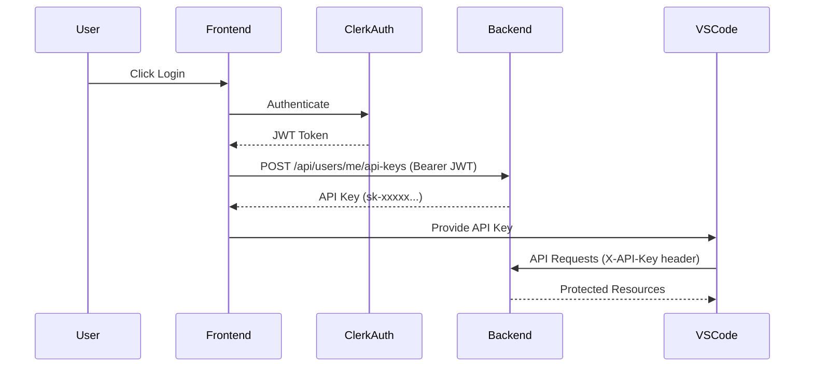

# 🔑 API Key Integration Guide

## Overview

Your backend now supports **dual authentication**:
1. **Clerk JWT** → For web frontend users
2. **API Keys** → For VS Code Extension and programmatic access

## ✅ Working Flow



## 📡 API Endpoints

### Create API Key
```http
POST /api/users/me/api-keys
Authorization: Bearer <clerk_jwt_token>
Content-Type: application/json

{
  "name": "My VS Code Extension Key"
}
```

**Response:**
```json
{
  "key": "sk-4gKaLKSKYBqe1T5bkiB8Zk5Xj5_Uj28HfY_xztNFEOg",
  "id": "6916846bf6e613c4555d54e6",
  "name": "My VS Code Extension Key",
  "created_at": "2025-11-14T01:22:50.123456Z",
  "expires_at": null
}
```

⚠️ **IMPORTANT:** The full API key is only returned ONCE during creation. Store it securely!

### List User's API Keys
```http
GET /api/users/me/api-keys
Authorization: Bearer <clerk_jwt_token>
```

**Response:**
```json
[
  {
    "id": "6916846bf6e613c4555d54e6",
    "name": "My VS Code Extension Key",
    "key_preview": "sk-4gKaL",
    "created_at": "2025-11-14T01:22:50Z",
    "last_used_at": null,
    "expires_at": null,
    "is_active": true
  }
]
```

### Revoke API Key
```http
DELETE /api/users/me/api-keys/{key_id}
Authorization: Bearer <clerk_jwt_token>
```

## 🎯 Frontend Integration (Next.js + Clerk)

### Step 1: Create API Key After Login

```typescript
// app/api-keys/create.ts
import { auth } from '@clerk/nextjs/server';

export async function createApiKey(name: string) {
  const { getToken } = auth();
  const token = await getToken();

  const response = await fetch('http://localhost:8000/api/users/me/api-keys', {
    method: 'POST',
    headers: {
      'Authorization': `Bearer ${token}`,
      'Content-Type': 'application/json',
    },
    body: JSON.stringify({ name }),
  });

  if (!response.ok) {
    throw new Error('Failed to create API key');
  }

  const data = await response.json();
  return data.key; // Store this securely!
}
```

### Step 2: Display API Key to User (One-Time)

```typescript
// app/settings/api-keys/page.tsx
'use client';

import { useState } from 'react';
import { useAuth } from '@clerk/nextjs';

export default function ApiKeysPage() {
  const { getToken } = useAuth();
  const [apiKey, setApiKey] = useState<string | null>(null);
  const [keys, setKeys] = useState([]);

  const handleCreateKey = async () => {
    const token = await getToken();
    
    const response = await fetch('http://localhost:8000/api/users/me/api-keys', {
      method: 'POST',
      headers: {
        'Authorization': `Bearer ${token}`,
        'Content-Type': 'application/json',
      },
      body: JSON.stringify({
        name: 'VS Code Extension',
      }),
    });

    const data = await response.json();
    setApiKey(data.key); // Show once, then hide forever
    loadKeys(); // Refresh the list
  };

  const loadKeys = async () => {
    const token = await getToken();
    const response = await fetch('http://localhost:8000/api/users/me/api-keys', {
      headers: {
        'Authorization': `Bearer ${token}`,
      },
    });
    const data = await response.json();
    setKeys(data);
  };

  return (
    <div className="p-8">
      <h1 className="text-2xl font-bold mb-4">API Keys</h1>
      
      {/* One-time display of new API key */}
      {apiKey && (
        <div className="bg-yellow-50 border border-yellow-200 p-4 mb-4 rounded">
          <p className="font-semibold text-yellow-800">⚠️ Save this API key now!</p>
          <p className="text-sm text-yellow-700 mb-2">
            It will never be shown again.
          </p>
          <code className="bg-yellow-100 px-2 py-1 rounded text-sm block mt-2">
            {apiKey}
          </code>
          <button
            onClick={() => {
              navigator.clipboard.writeText(apiKey);
              alert('Copied to clipboard!');
            }}
            className="mt-2 bg-yellow-600 text-white px-4 py-2 rounded"
          >
            Copy to Clipboard
          </button>
        </div>
      )}

      {/* Create button */}
      <button
        onClick={handleCreateKey}
        className="bg-blue-600 text-white px-4 py-2 rounded mb-4"
      >
        Create New API Key
      </button>

      {/* List of existing keys */}
      <div className="space-y-2">
        {keys.map((key: any) => (
          <div key={key.id} className="border p-4 rounded">
            <div className="flex justify-between items-center">
              <div>
                <p className="font-semibold">{key.name}</p>
                <p className="text-sm text-gray-600">
                  Preview: {key.key_preview}****
                </p>
                <p className="text-xs text-gray-500">
                  Created: {new Date(key.created_at).toLocaleString()}
                </p>
              </div>
              <button
                onClick={() => handleRevokeKey(key.id)}
                className="text-red-600 hover:text-red-800"
              >
                Revoke
              </button>
            </div>
          </div>
        ))}
      </div>
    </div>
  );
}
```

## 🔌 VS Code Extension Integration

### Using the API Key

```typescript
// extension.ts
import * as vscode from 'vscode';

async function makeApiRequest(endpoint: string) {
  const config = vscode.workspace.getConfiguration('yourExtension');
  const apiKey = config.get<string>('apiKey');
  const apiEndpoint = config.get<string>('apiEndpoint') || 'http://localhost:8000';

  if (!apiKey) {
    vscode.window.showErrorMessage('Please configure your API key in settings');
    return;
  }

  const response = await fetch(`${apiEndpoint}${endpoint}`, {
    headers: {
      'X-API-Key': apiKey,
    },
  });

  if (!response.ok) {
    throw new Error(`API error: ${response.statusText}`);
  }

  return await response.json();
}

// Example usage
async function getUserProfile() {
  try {
    const user = await makeApiRequest('/api/users/me');
    vscode.window.showInformationMessage(`Logged in as: ${user.email}`);
  } catch (error) {
    vscode.window.showErrorMessage(`Error: ${error.message}`);
  }
}
```

### Extension Configuration (package.json)

```json
{
  "contributes": {
    "configuration": {
      "title": "Your Extension",
      "properties": {
        "yourExtension.apiKey": {
          "type": "string",
          "default": "",
          "description": "API Key for authentication (get from your dashboard)"
        },
        "yourExtension.apiEndpoint": {
          "type": "string",
          "default": "http://localhost:8000",
          "description": "Backend API endpoint"
        }
      }
    }
  }
}
```

## 🔒 Security Best Practices

### Backend
- ✅ API keys are hashed before storage (SHA-256)
- ✅ Only preview shown in list endpoint (first 8 chars)
- ✅ Full key only returned once on creation
- ✅ Keys can be revoked instantly
- ✅ Supports expiration dates (optional)

### Frontend
- ⚠️ **Never commit API keys to git**
- ⚠️ **Never log API keys**
- ✅ Store in secure storage (VS Code SecretStorage API)
- ✅ Show one-time modal with copy button
- ✅ Allow users to revoke compromised keys

### VS Code Extension
```typescript
// Use SecretStorage API (better than settings)
import * as vscode from 'vscode';

async function storeApiKey(context: vscode.ExtensionContext, apiKey: string) {
  await context.secrets.store('apiKey', apiKey);
}

async function getApiKey(context: vscode.ExtensionContext): Promise<string | undefined> {
  return await context.secrets.get('apiKey');
}
```

## 📊 Authentication Priority

The backend checks authentication in this order:

1. **X-API-Key header** (highest priority)
   ```http
   X-API-Key: sk-xxxxx...
   ```

2. **Bearer token with API key** (alternative format)
   ```http
   Authorization: Bearer sk-xxxxx...
   ```

3. **Clerk JWT token** (for web frontend)
   ```http
   Authorization: Bearer eyJhbGciOi...
   ```

4. **Legacy JWT token** (backward compatibility)

## 🧪 Testing

Run the test script:

```bash
cd user-management-backend
python test_api_keys_clerk.py
```

**Expected output:**
```
✅ User created
✅ JWT Token obtained
✅ API Key created!
Full API Key: sk-4gKaLKSKYBqe1T5bkiB8Zk5Xj5_Uj28HfY_xztNFEOg
✅ Found 1 API key(s)
```

## 🚀 Quick Start

### For Frontend Developers

1. User logs in with Clerk
2. After login, call: `POST /api/users/me/api-keys`
3. Display the returned `key` to user ONE TIME
4. Store in secure location (for VS Code Extension setup)
5. Allow users to list/revoke keys in dashboard

### For Extension Developers

1. Add API key field to extension settings
2. Use `X-API-Key` header for all API requests
3. Handle 401 errors gracefully (prompt for new key)
4. Use VS Code SecretStorage API, not plain settings

## 📝 Response Schemas

### ApiKeyCreateResponse
```typescript
interface ApiKeyCreateResponse {
  key: string;           // Full API key (only in creation response)
  id: string;            // Unique key ID
  name: string;          // Human-readable name
  created_at: string;    // ISO 8601 timestamp
  expires_at: string | null;  // Optional expiration
  is_active: boolean;    // Whether key is active
}
```

### ApiKeyResponse (List)
```typescript
interface ApiKeyResponse {
  id: string;
  name: string;
  key_preview: string;   // First 8 characters only
  created_at: string;
  last_used_at: string | null;
  expires_at: string | null;
  is_active: boolean;
}
```

## 🎉 Summary

Your backend now has complete API key management:

✅ **Create** - Users can generate API keys after Clerk login  
✅ **List** - View all their API keys (with previews)  
✅ **Revoke** - Instantly deactivate compromised keys  
✅ **Secure** - Keys hashed in database, full key shown once  
✅ **Flexible** - Works with both JWT and API key auth  

**Test it now:**
```bash
python test_api_keys_clerk.py
```
