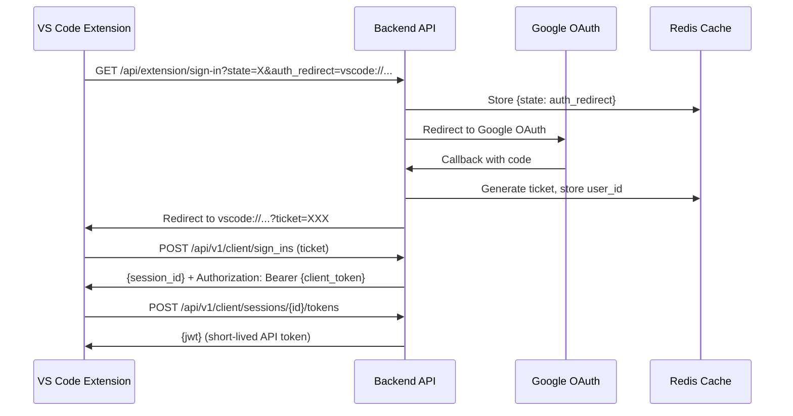

# Extension Authentication Flow

This document describes how VS Code extension users authenticate with the CodeMurf backend.

## Overview

The extension uses a **Clerk-compatible OAuth flow** via Google authentication. The backend implements endpoints that mimic Clerk's API, allowing the extension to authenticate without changes.

## Authentication Flow



## API Endpoints

### 1. Initiate Sign-In

```
GET /api/extension/sign-in?state=<csrf_token>&auth_redirect=<vscode_uri>
```

- Redirects to Google OAuth
- `state`: CSRF protection token from extension
- `auth_redirect`: VS Code URI scheme (e.g., `vscode://codemurf.extension/callback`)

### 2. Exchange Ticket for Session

```
POST /api/v1/client/sign_ins
Content-Type: application/x-www-form-urlencoded

strategy=ticket&ticket=<authorization_ticket>
```

**Response:**

```json
{
  "response": { "created_session_id": "abc123..." }
}
```

**Headers:** `Authorization: Bearer <client_token>` (365-day token)

### 3. Get Short-Lived JWT

```
POST /api/v1/client/sessions/{session_id}/tokens
Authorization: Bearer <client_token>
```

**Response:**

```json
{ "jwt": "eyJ..." }
```

JWT is valid for 1 hour for API calls.

### 4. Get User Info

```
GET /api/v1/me
Authorization: Bearer <client_token|jwt>
```

**Response:**

```json
{
  "response": {
    "id": "user_id",
    "email_addresses": [{ "email_address": "user@example.com" }]
  }
}
```

### 5. Logout

```
POST /api/v1/client/sessions/{session_id}/remove
Authorization: Bearer <client_token>
```

## Token Types

| Token Type       | Lifetime | Purpose                         |
| ---------------- | -------- | ------------------------------- |
| **Ticket**       | 5 min    | One-time exchange after OAuth   |
| **Client Token** | 365 days | Long-lived, stored by extension |
| **Session JWT**  | 1 hour   | Short-lived for API calls       |

## Redis Keys

| Key Pattern                 | TTL     | Data                      |
| --------------------------- | ------- | ------------------------- |
| `extension:auth:{state}`    | 10 min  | `{auth_redirect, source}` |
| `extension:ticket:{ticket}` | 5 min   | `{user_id, email}`        |
| `extension:session:{id}`    | 30 days | `{user_id, email}`        |

## Status: ✅ Verified Working

All endpoints tested and confirmed operational.
